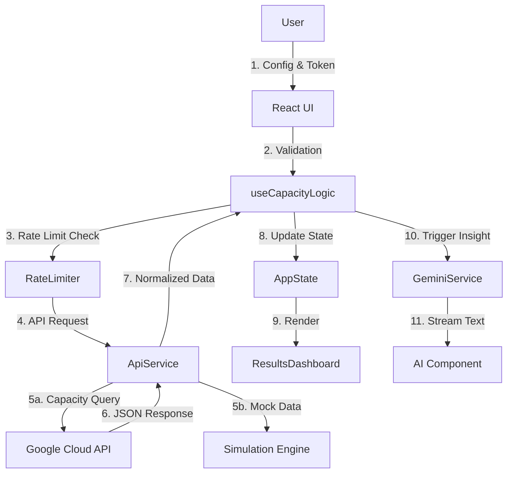

# Project History & Documentation

## 1. Executive Summary
**Name:** Spot Capacity Advisor
**Version:** 2.18.1
**Description:** Enterprise-grade Google Cloud Spot Capacity Advisor with Optimized Performance and AI Insights.
**Purpose:** To assist Cloud Architects and FinOps practitioners in identifying the optimal Google Cloud regions and zones for Spot VM deployments, minimizing preemption risk and maximizing obtainability.
**Tech Stack:** React 18, TypeScript, Vite, Tailwind CSS, Framer Motion, Recharts, Google GenAI SDK.

---

## 2. System Architecture

The application is designed as a **stateless, client-side Single Page Application (SPA)** that interacts directly with Google Cloud APIs. It acts as a "pane of glass" over the raw Compute Engine Capacity API.

### 2.1. Integration Pattern: Direct-to-API
Unlike traditional web apps that proxy requests through a backend, this tool calls Google Cloud APIs directly from the browser.
-   **Authentication:** Relies on short-lived OAuth 2.0 Access Tokens provided by the user (typically via `gcloud auth print-access-token`).
-   **Authorization:** The token must have `https://www.googleapis.com/auth/compute.readonly` scope.
-   **Endpoints Used:**
    -   **Capacity API (Alpha):** `POST https://compute.googleapis.com/compute/alpha/projects/{project}/regions/{region}/advice/capacity`
    -   **Region Discovery:** `GET https://compute.googleapis.com/compute/v1/projects/{project}/regions`
    -   **Machine Types:** `GET https://compute.googleapis.com/compute/v1/projects/{project}/zones/{zone}/machineTypes`
    -   **Token Info:** `GET https://oauth2.googleapis.com/tokeninfo`
    -   **Storage (GCS):** `https://storage.googleapis.com/storage/v1/b/{bucket}/...`

### 2.2. Data Flow Diagram


### 2.3. Directory Structure & File Descriptions

```
/src
├── App.tsx                  # Main Application Shell. Orchestrates layout, global providers (Toast, CommandPalette), and routing logic.
├── config.ts                # Static configuration data (Regions, Machine Types, Families) and constants.
├── constants.tsx            # UI Constants and Icon definitions (Lucide React).
├── export.ts                # Utilities for exporting results to CSV, PDF, HTML, and JSON.
├── index.tsx                # Application Entry Point. Mounts React to DOM.
├── styles.css               # Global Styles, Tailwind directives, and custom utility classes.
├── types.ts                 # TypeScript Interfaces and Types. The "Contract" of the application.
├── utils.ts                 # Helper functions for data formatting, UUID generation, and math.
├── vite-env.d.ts            # Vite environment type definitions.
│
├── components/              # Reusable UI Components
│   ├── Autocomplete.tsx     # Generic Autocomplete Input with fuzzy search.
│   ├── CommandPalette.tsx   # Global Command Menu (Cmd+K) for quick actions.
│   ├── ComparisonView.tsx   # Side-by-side comparison view for multiple analysis runs.
│   ├── ConfigurationPanel.tsx # Main Form for user input (Project, Region, Machine Type).
│   ├── DebouncedInputs.tsx  # Input components with built-in debounce for performance.
│   ├── DebugConsole.tsx     # Floating developer console for inspecting state/logs.
│   ├── ErrorBoundary.tsx    # React Error Boundary to catch component tree crashes.
│   ├── GeminiCard.tsx       # AI Insights display card with streaming text support.
│   ├── GuideModal.tsx       # Help/Documentation modal for users.
│   ├── Header.tsx           # Top navigation bar and global controls.
│   ├── HistoryTab.tsx       # View for browsing past analysis runs.
│   ├── MachineTypeInfo.tsx  # Info card displaying specs of selected machine type.
│   ├── RegionAutocomplete.tsx # Specialized autocomplete for GCP Regions.
│   ├── ResultsDashboard.tsx # Main view for displaying analysis results (Charts + Tables).
│   ├── ScoreGauge.tsx       # Visual gauge component for Obtainability Scores.
│   ├── SkeletonCard.tsx     # Loading state placeholder component.
│   ├── Toast.tsx            # Toast notification system.
│   ├── ZoneComparisonChart.tsx # Bar chart comparing availability across zones.
│   └── ZoneDistributionChart.tsx # Pie/Donut chart for zone distribution.
│
├── hooks/                   # Custom React Hooks
│   ├── useCapacityLogic.ts  # THE BRAIN. Manages global app state, API calls, and business logic.
│   └── useStreamAI.ts       # Manages streaming responses from Gemini API.
│
└── services/                # Business Logic & API Layers
    ├── apiService.ts        # Google Cloud Compute Engine API client (Alpha).
    ├── geminiService.ts     # Google Gemini AI client (Generative Insights).
    ├── rateLimiter.ts       # Client-side Token Bucket Rate Limiter.
    ├── simulationEngine.ts  # Mock Data Generator for "Simulation Mode".
    └── storageService.ts    # Google Cloud Storage client for history persistence.
```

---

## 3. Core Mechanisms & Algorithms

### 3.1. Batch Processing (Concurrency & Queueing)
The application supports queuing multiple configuration scenarios to run in parallel.
-   **Queue System:** Users can add up to 3 scenarios to a batch queue (`state.scenarios`).
-   **Concurrency Algorithm:** The `runBatchAnalysis` function uses a **Worker Pattern** to execute requests with a concurrency limit of **5**.
    -   *Why?* Browsers typically limit concurrent connections per domain (HTTP/1.1) or have global limits. Limiting to 5 prevents "Head-of-Line Blocking" and network stalls.
-   **Parallel Execution:** Uses `Promise.all` with the worker pattern to process the queue efficiently.
-   **Status Tracking:** Each scenario tracks its own status (`pending`, `loading`, `success`, `error`) allowing for partial batch failures.

### 3.2. Rate Limiting (Token Bucket Algorithm)
To prevent API abuse and handle quotas gracefully, a client-side rate limiter is implemented in `rateLimiter.ts`.
-   **Algorithm:** **Token Bucket**.
-   **Configuration:**
    -   **Capacity:** 120 tokens (requests).
    -   **Refill Rate:** 2 tokens/second (120 per minute).
-   **Behavior:**
    -   `tryRequest()`: Consumes a token if available.
    -   `waitForToken()`: Asynchronously pauses execution if bucket is empty, resolving when tokens refill. This "smooths" bursty traffic from batch operations.

### 3.3. AI Integration (Streaming & Context)
The app integrates with Google Gemini for predictive insights.
-   **Service:** `geminiService.ts` handles all AI interactions.
-   **Streaming:** `useStreamAI` hook manages the `AsyncGenerator` response from Gemini to provide real-time feedback (Typewriter effect).
-   **Prompt Engineering:**
    -   **Grounding:** Prompts include **Real-Time API Data** (obtainability scores, uptime) serialized as Markdown tables.
    -   **Verification:** The System Instruction mandates the model to use the `googleSearch` tool to verify Service Health and Regional Events before answering.
    -   **Comparison:** A specialized prompt compares multiple scenarios side-by-side, analyzing trade-offs and declaring a "winner".

### 3.4. Simulation Engine (Mock Mode vs. Real Mode)
The application features a sophisticated dual-mode execution engine.

#### A. Real Mode (Live API)
-   **Trigger:** `state.mockMode = false` (Default).
-   **Logic:** Requests are routed via `apiService` to the actual Google Cloud Compute Engine API.
-   **Latency:** Dependent on network and API response times (typically 200ms - 1.5s).
-   **Data:** Returns authoritative, real-time capacity data from Google's internal supply chain systems.

#### B. Mock Mode (Simulation Engine)
-   **Trigger:** `state.mockMode = true`.
-   **Purpose:** Allows users to explore the UI, test batch workflows, and visualize reports without needing a valid Google Cloud Access Token or incurring quota usage.
-   **Engine Logic (`simulationEngine.ts`):**
    -   **Deterministic Hashing:** Uses a custom `pseudoRandom` function seeded with `${region}-${zone}-${machineType}`. This ensures that running the same "simulation" twice yields the same result, mimicking stable infrastructure.
    -   **Scarcity Tiers:** Machine types are classified into tiers (1=Abundant/E2 to 5=AllocationOnly/H100).
    -   **Pool Depth Estimation:** Estimates the theoretical spot pool size based on the tier (e.g., Tier 1 has ~5000 slots, Tier 5 has ~50).
    -   **Saturation Calculation:** `saturation = requestSize / poolDepth`. High saturation drastically reduces the calculated `obtainability` score.
    -   **Regional Bias:** Applies modifiers based on real-world region characteristics (e.g., `us-east1` is modeled as "congested" with a negative modifier, while `us-west4` is "optimistic").
    -   **Noise Injection:** Adds deterministic noise (+/- 7%) to simulate market fluctuations.

---

## 4. Operational Flows (Detailed)

### 4.1. Capacity Analysis Flow (Happy Path)
1.  **Configuration:** User enters Project ID, selects Region, Machine Type, and Count.
2.  **Validation:** Input is validated against regex (Project ID) and dynamic API data (Region/Zone availability).
3.  **Request Construction:** `buildCapacityAdvisorRequest` creates the JSON payload for the Compute Engine API.
4.  **Rate Limiting:** `apiRateLimiter` ensures requests do not exceed 120 requests/minute.
5.  **API Execution:** `gcpRequest` sends the request to the Google Cloud API.
6.  **Response Handling:**
    -   **Success:** Data is parsed, sorted by obtainability score, and stored in `AppState`.
    -   **Error:** Errors are caught, classified (Quota, Auth, Generic), and displayed.
7.  **AI Insight:** `geminiService` is triggered automatically to provide context.

### 4.2. Batch Analysis Flow
1.  **Queueing:** User configures a scenario -> Clicks "Add to Queue".
2.  **Repeat:** User adds up to 3 scenarios.
3.  **Batch Run:** User clicks "Run Batch".
4.  **Parallel Execution:** System runs scenarios concurrently (Limit: 5).
5.  **Partial Failure Handling:** If one scenario fails, others continue. UI shows mixed status.
6.  **Retry:** User can click "Retry" on individual failed items to re-run just that specific configuration.

### 4.3. Error Handling Flow
1.  **Detection:** Error occurs (Network, Auth, Validation).
2.  **Classification:**
    *   **Auth Error:** "Missing Scope" -> Prompt user to run `gcloud auth`.
    *   **Quota Error:** "429/Resource Exhausted" -> Rate limiter pauses or UI shows "Quota Exceeded".
    *   **Logic Error:** Caught by `try/catch` blocks.
3.  **Notification:**
    *   **Toast:** Transient popup for non-blocking errors.
    *   **Inline:** Error message in the specific card (e.g., "Region Unavailable").
    *   **Debug Console:** Full stack trace logged to `DebugData`.

### 4.4. Abnormal Conditions Handling
-   **Authentication Failures (401/403):** Detected by `apiService`. UI displays "Authentication Failed". User action: Refresh token.
-   **Capacity Stockouts (Empty Response):** API returns 200 but empty list. `apiService` throws custom 404. UI shows "Stockout" illustration.
-   **Configuration Drift:** User changes settings *after* a run. `ConfigurationPanel` detects mismatch vs `lastRunConfigRef`. Run button blinks.

### 4.5. Data Handling & Lifecycle
The application manages data through a strict lifecycle to ensure consistency and privacy.

1.  **Input (User Action):**
    -   Data enters via `ConfigurationPanel` (Project, Region, etc.).
    -   Sanitized immediately via React state binding.
2.  **Processing (In-Memory):**
    -   Data is normalized into `CapacityAdvisorRequest` format.
    -   Stored in `AppState` (RAM only).
3.  **Transmission (Secure):**
    -   Sent to Google Cloud APIs via HTTPS (TLS 1.3).
    -   Access Token is attached as `Authorization: Bearer` header.
4.  **Storage (Ephemeral vs. Persistent):**
    -   **Access Tokens:** Ephemeral. Lost on page refresh (unless re-entered).
    -   **Results:** Ephemeral. Lost on page refresh.
    -   **History (Optional):** If "Sync History" is enabled, results are encrypted and stored in the user's private GCS bucket.
    -   **Preferences:** Persistent. Theme and last-used region stored in `localStorage`.
5.  **Disposal:**
    -   Closing the tab clears all sensitive data from memory.
    -   `resetApplication` function explicitly wipes `localStorage` and resets state.

---

## 5. State Management

The application uses a monolithic state object (`AppState`) managed by `useCapacityLogic`. This ensures a single source of truth.

### 5.1. Key State Slices
-   **`batchResults`**: Array of `ScenarioResult`.
    -   `status`: 'pending' | 'loading' | 'success' | 'error'
    -   `response`: The API payload.
    -   `errorDetails`: String message if failed.
-   **`debugData`**: Stores logs, network requests (redacted), and AI prompts.
-   **`history`**: Persistent log of past runs.
-   **`validationErrors`**: Map of field names to error states.
-   **`toasts`**: Queue of active notifications.

### 5.2. State Transitions
-   **Idle -> Loading:** Triggered by `runBatchAnalysis`. Clears previous errors.
-   **Loading -> Success:** Updates `batchResults`, triggers `useStreamAI`.
-   **Loading -> Error:** Updates `batchResults` with error, logs to Debug Console.
-   **Streaming -> Idle:** AI stream completes or is aborted.

---

## 6. Security Considerations & Mitigations

### 6.1. Threat Model: Token Leakage
-   **Risk:** Access tokens are powerful credentials. Storing them insecurely (e.g., `localStorage`) exposes them to XSS attacks.
-   **Mitigation:**
    -   **Memory-Only Storage:** Tokens are stored *only* in React State (`AppState`).
    -   **No Persistence:** The `useEffect` that saves state to `localStorage` explicitly excludes `accessToken`.
    -   **Redaction:** The `DebugConsole` and `NetworkLog` automatically regex-replace `Bearer [token]` with `Bearer [HIDDEN]` before rendering or storing logs.

### 6.2. Threat Model: Injection Attacks
-   **Risk:** Malicious Project IDs or inputs could be used to inject shell commands into the "Simulated cURL" display.
-   **Mitigation:**
    -   **Strict Validation:** Project IDs are validated against `/^[a-z][a-z0-9-]{4,28}[a-z0-9]$/`.
    -   **React Escaping:** All user inputs rendered in the DOM are automatically escaped by React.

### 6.3. Threat Model: API Abuse
-   **Risk:** The tool could be used to DoS the Google Cloud API.
-   **Mitigation:**
    -   **Rate Limiting:** Client-side Token Bucket ensures the app behaves like a "good citizen" (Max 120 req/min).

### 6.4. Deployment Security & Infrastructure (Nginx)
Although the application is a client-side SPA, it is typically served via a containerized Nginx instance in production environments (e.g., Cloud Run).
-   **Nginx Configuration:**
    -   **Security Headers:** The Nginx server block is configured to send strict security headers:
        -   `X-Frame-Options: DENY` (Prevents Clickjacking).
        -   `X-Content-Type-Options: nosniff` (Prevents MIME sniffing).
        -   `Referrer-Policy: strict-origin-when-cross-origin`.
    -   **SPA Routing:** Configured with `try_files $uri $uri/ /index.html;` to support client-side routing without 404s.
    -   **Gzip Compression:** Enabled for text assets (JS, CSS, HTML) to reduce bandwidth and improve load times.
-   **Container Security:**
    -   **Non-Root User:** The Docker container runs as a non-root user (e.g., `nginx` user) to minimize privilege escalation risks.
    -   **Minimal Base Image:** Uses `nginx:alpine` for a reduced attack surface.

### 6.5. Container Specification
The application is packaged as a Docker container optimized for security and performance.

-   **Base Images:**
    -   **Build Stage:** `node:22-alpine` (Latest LTS, minimal footprint).
    -   **Runtime Stage:** `nginx:alpine` (Lightweight web server).
-   **Port:** Exposes port `3000` (mapped to Nginx internal port).
-   **Security Hardening:**
    -   **Non-Root User:** Runs as the `nginx` user, not `root`.
    -   **Permission Fixes:** Explicit `chown` and `chmod` on `/usr/share/nginx/html`, `/var/cache/nginx`, and `/var/log/nginx` to allow non-root operation.
    -   **Clean Build:** Default Nginx static assets are removed before copying the build artifacts.
-   **Build Arguments:**
    -   `API_KEY`: Injected at build time to populate `VITE_API_KEY` for the Gemini SDK.

---

## 7. Performance Optimizations

### 7.1. Render Performance
-   **Memoization:** `React.memo` is applied to `ConfigurationPanel` and `ResultsDashboard`. These components only re-render when their specific props (like `result` or `loading`) change, not on every keystroke in the parent.
-   **Debouncing:** Text inputs (`DebouncedInput`) wait 300ms before updating the global state. This prevents the heavy `ConfigurationPanel` from re-rendering on every character typed.

### 7.2. Bundle Size & Load Time
-   **Code Splitting:**
    -   `DebugConsole`, `GuideModal`, and heavy Chart components (`Recharts`) are lazy-loaded using `React.lazy` and `Suspense`.
    -   **Impact:** The initial JavaScript bundle is significantly smaller, improving First Contentful Paint (FCP).

### 7.3. Network Efficiency
-   **Caching:** `apiService` caches Region and Machine Type lists for 5 minutes. This eliminates redundant calls to `compute.regions.list` when switching tabs.
-   **Concurrency Control:** The Batch Runner limits concurrent requests to **5**. This prevents browser network stall (Head-of-Line blocking).

---

## 8. Dependencies & Packages

The project leverages a modern, robust ecosystem of React libraries. Here is a detailed breakdown of the key dependencies and the rationale for their selection:

### 8.1. Core Framework
-   **`react` / `react-dom` (v18.3.1):** The foundation. React 18's concurrent features (like `useTransition` and automatic batching) are crucial for the smooth "streaming" UI updates used in the AI components.
-   **`vite` (v5.0.12):** Chosen over Create React App for its lightning-fast HMR (Hot Module Replacement) and optimized Rollup-based production builds. It handles the complex ESM imports required by the Google GenAI SDK seamlessly.

### 8.2. UI & Styling
-   **`tailwindcss` (v3.4.17):** Utility-first CSS. Allows for rapid UI iteration and consistent design tokens (colors, spacing) without managing large CSS files.
-   **`tailwind-merge` (v2.6.0) & `clsx` (v2.1.1):** Essential for building reusable components. They allow us to safely merge default Tailwind classes with custom props (e.g., `<Card className="bg-red-500" />`) without conflict.
-   **`lucide-react` (v0.469.0):** The icon library. Chosen for its consistency, small bundle size (tree-shakeable), and modern aesthetic compared to Material Icons.

### 8.3. Animation & Visualization
-   **`framer-motion` (v11.0.8):** The industry standard for React animations.
    -   *Usage:* It powers the complex layout transitions in the Batch Queue (items sliding in/out), the "Pulse" effect on the Run button, and the smooth entrance of the Results Dashboard.
    -   *Why:* CSS transitions are insufficient for layout changes (like an item being removed from a list). Framer Motion handles `layout` animations automatically.
-   **`recharts` (v3.6.0):** A composable charting library built on D3.
    -   *Usage:* Renders the `ZoneComparisonChart` (Bar) and `ZoneDistributionChart` (Donut).
    -   *Why:* It is React-native (component-based) and highly customizable, making it easier to integrate with our Tailwind theme than raw D3 or Chart.js.

### 8.4. AI & Data
-   **`@google/genai` (v1.34.0):** The official Google SDK for Gemini.
    -   *Usage:* Handles the streaming connection to the Gemini 2.5 Flash model.
    -   *Why:* Provides a strongly-typed interface for the new `generateContentStream` API, simplifying the handling of chunks and grounding metadata.
-   **`react-markdown` (v10.1.0):** Renders the AI's Markdown response safely.
    -   *Why:* The AI outputs structured text (tables, lists, bolding). This library converts it to HTML while sanitizing inputs to prevent XSS.

### 8.5. Utilities
-   **`jspdf` (v2.5.2) & `jspdf-autotable` (v3.8.4):**
    -   *Usage:* Generates the PDF export of the capacity report.
    -   *Why:* Allows for client-side PDF generation without a backend. `autotable` is specifically used to render the complex data grids into the PDF.

---

## 9. Developer Guide

### 9.1. Key Files
-   **`src/hooks/useCapacityLogic.ts`**: The "Controller". It holds the `AppState` and exposes actions (`handleSearch`, `addScenario`). If you need to add a new global state variable, add it here.
-   **`src/services/apiService.ts`**: The "Model". It defines the `gcpRequest` wrapper. If you need to add a new API endpoint, add a function here.
-   **`src/components/ConfigurationPanel.tsx`**: The "View" for inputs. It handles validation logic and UI feedback.

### 9.2. Adding a New Feature
1.  **Define Types:** Update `src/types.ts` with any new data structures.
2.  **Update State:** Add fields to `AppState` in `useCapacityLogic.ts`.
3.  **Update UI:** Create/Modify components in `src/components/`.
4.  **Add Logic:** Implement the feature in `useCapacityLogic.ts`.
5.  **Verify:** Run `npm run lint` and check `DebugConsole` for errors.

### 9.3. Debugging
-   **Debug Console:** Press the "Terminal" icon (bottom right) to open the built-in debugger. It shows:
    -   **State:** Current snapshot of `AppState`.
    -   **Logs:** Internal application logs.
    -   **Network:** Redacted headers/bodies of all API calls.
    -   **Gemini:** Raw prompts and responses from the AI.

---

## 10. Recent Changelog (v2.18.1)
-   **Feature:** Added `retryScenario` to allow re-running specific failed batch items.
-   **Feature:** Added `resetApplication` for a full factory reset.
-   **UX:** Implemented "Configuration Drift" detection (Blinking Run button + Toast).
-   **Docs:** Major expansion of `project_history.md` (this file).
-   **Security:** Enhanced token validation logic in `validateTokenScopes`.

---

## 11. Reverse Engineering Reference

This section contains low-level details useful for debugging, extending, or reverse-engineering the application's behavior.

### 11.1. API Request Schema (`CapacityAdvisorRequest`)
The application sends this exact JSON structure to the Google Cloud Capacity API.

```typescript
interface CapacityAdvisorRequest {
  instanceProperties: {
    scheduling: {
      provisioningModel: "SPOT" | "STANDARD";
    };
  };
  instanceFlexibilityPolicy: {
    instanceSelections: {
      [key: string]: {
        machineTypes: string[]; // e.g., ["n2-standard-4"]
      };
    };
  };
  distributionPolicy: {
    targetShape: "ANY" | "ANY_SINGLE_ZONE";
    zones?: Array<{ zone: string }>; // Optional constraint
  };
  size: number; // Total instance count requested
}
```

### 11.2. API Response Schema (`CapacityAdvisorResponse`)
The application expects this structure back. Note that `scores` can be an array or an object depending on the API version (Alpha vs V1), and the app handles both via normalization.

```typescript
interface CapacityAdvisorResponse {
  recommendations: Array<{
    scores: Array<{ name: string; value: number }> | {
      obtainability: number; // 0.0 to 1.0
      uptimeScore: number;   // 0.0 to 1.0
    };
    shards: Array<{
      location?: string; // e.g., "projects/.../zones/us-central1-a"
      zone?: string;     // Normalized field
      machineType: string;
      instanceCount: number;
      provisioningModel: "SPOT";
    }>;
  }>;
}
```

### 11.3. Custom CSS & Animations (`styles.css`)
The app uses Tailwind CSS with custom utility classes defined in `src/styles.css`.

-   **Animations:**
    -   `@keyframes pulse-ring`: Creates the "radar ping" effect on the Run button when configuration changes.
    -   `@keyframes fadeInUp`: Used for the smooth entry of cards in the dashboard.
-   **Component Classes:**
    -   `.card-panel`: Adds the "glassy" border, hover glow, and subtle shadow.
    -   `.input-field`: Standardizes form inputs with a specific focus ring color (`indigo-500`).
    -   `.btn-primary`: The main action button with a custom shadow stack.

### 11.4. Configuration Constants (`config.ts`)
-   **`REGIONS`**: A hardcoded list of supported GCP regions (e.g., `us-central1`, `europe-west4`).
-   **`REGION_CONFIG`**: Maps regions to their specific zones (e.g., `us-central1` -> `['us-central1-a', 'us-central1-b', ...]`).
-   **`MACHINE_TYPES`**: A massive array of machine type definitions generated programmatically to save bundle size.
    -   *Generation Logic:* Helper functions like `generateMachineTypes` create permutations of series (N2, C3), suffixes (standard, highmem), and core counts.

### 11.5. Hook Internals (`useCapacityLogic`)
-   **Dependency Chain:**
    -   `runBatchAnalysis` depends on `state.scenarios` and `state.accessToken`.
    -   `useEffect` for **History Sync** depends on `state.accessToken` and `state.project`.
    -   `useEffect` for **Data Freshness** runs every 15s to check `lastFetchTimeRef`.
-   **Ref Usage:**
    -   `abortControllerRef`: Used to cancel in-flight API requests when the user clicks "Stop" or navigates away.
    -   `lastRunConfigRef`: Used to detect "Configuration Drift" by comparing it with current state.

---

## 12. Advanced State & Error Handling

This section details the robust error handling and state management strategies employed to ensure enterprise-grade reliability.

### 12.1. Global Error Boundary (`ErrorBoundary.tsx`)
The entire application is wrapped in a React Error Boundary to catch unhandled exceptions in the component tree (e.g., rendering errors, undefined prop access).

-   **Behavior:**
    -   Catches errors during the render phase, lifecycle methods, and constructors of children.
    -   **Fallback UI:** Displays a "Component Error" card with a "Reload Page" button and a collapsible stack trace (in development).
    -   **Recovery:** The "Reload Page" button triggers `window.location.reload()` to reset the application state completely.
-   **Usage:** Wraps the main `<App />` component in `index.tsx`.

### 12.2. State Machine & Transitions (`useCapacityLogic.ts`)
The `AppState` object acts as a finite state machine for the analysis workflow.

| State | Trigger | Next State | Side Effects |
| :--- | :--- | :--- | :--- |
| **Idle** | `runBatchAnalysis` | **Loading** | Clears `result`, `error`. Sets `loading=true`. |
| **Loading** | API Success (200) | **Success** | Sets `batchResults`, `loading=false`. Triggers `useStreamAI`. |
| **Loading** | API Error (4xx/5xx) | **Error** | Sets `error`, `loading=false`. Logs to Debug Console. |
| **Success** | `streamComparisonInsights` | **Streaming** | Updates `groundingMetadata` incrementally. |
| **Streaming** | Stream End / Abort | **Idle** | Sets `groundingLoading=false`. |

### 12.3. Granular Error Classification
The application distinguishes between different types of errors to provide actionable user feedback.

1.  **Validation Errors (Pre-Flight):**
    -   *Source:* `ConfigurationPanel` / `useCapacityLogic`.
    -   *UI:* Red border on input fields, helper text (e.g., "Invalid Project ID format").
    -   *Blocking:* Prevents the "Run" button from being clicked.

2.  **Authentication Errors (401/403):**
    -   *Source:* `apiService.ts` -> `gcpRequest`.
    -   *Detection:* HTTP status code.
    -   *UI:* Toast notification: "Authentication Failed. Please refresh your token."
    -   *Action:* User must run `gcloud auth` again.

3.  **Quota/Rate Limit Errors (429):**
    -   *Source:* `rateLimiter.ts` or API response.
    -   *Handling:* Automatic exponential backoff (retry).
    -   *UI:* If retries fail, Toast: "API Quota Exceeded."

4.  **Stockout Errors (Logic 404):**
    -   *Source:* API returns 200 OK but empty `recommendations` list.
    -   *Handling:* Treated as a "Soft Error".
    -   *UI:* Specialized "Empty State" illustration in `ResultsDashboard` advising the user to broaden their search (e.g., "Try 'Any' shape").

### 12.4. React Query-like Patterns (Custom Implementation)
While not using `react-query`, the app implements similar patterns in `useCapacityLogic`:

-   **Stale-While-Revalidate:** The app displays previous results (`state.result`) while a new batch run (`state.loading`) is in progress, preventing UI flicker.
-   **Optimistic Updates:** When adding a scenario to the queue, the UI updates immediately before any background validation occurs.
-   **Ref-based Freshness:** `lastFetchTimeRef` tracks the timestamp of the last successful data fetch. A `useEffect` interval checks this every 15s and shows a "Stale Data" warning toast if data is >2 minutes old.

---

## 13. GCP Integration & Permissions

This section details the specific Google Cloud Platform (GCP) requirements for the application to function in "Real Mode".

### 13.1. Required IAM Permissions
The user's Access Token must be associated with a principal (User or Service Account) that has the following permissions on the target Project:

-   **`compute.regions.list`**: Required to fetch the list of available regions.
-   **`compute.zones.list`**: Required to fetch zones within a region.
-   **`compute.machineTypes.list`**: Required to populate the Machine Type dropdown dynamically.
-   **`compute.instanceGroupManagers.list`** (Optional): Used for future integrations with Managed Instance Groups.
-   **`compute.capacity.get`** (Alpha): The core permission required to query the Capacity Advisor API.

**Recommended Role:**
-   `roles/compute.viewer` (Contains all the above read-only permissions).

### 13.2. Required API Enablement
The target GCP Project must have the following APIs enabled:

1.  **Compute Engine API** (`compute.googleapis.com`): Core infrastructure API.
2.  **Service Usage API** (`serviceusage.googleapis.com`): Used to check quota and API status.
3.  **Cloud Storage JSON API** (`storage-api.googleapis.com`): Required if using the History Sync feature.

### 13.3. OAuth Scope & Token Usage
The application strictly adheres to the Principle of Least Privilege regarding OAuth scopes.

-   **Scope Requested:** `https://www.googleapis.com/auth/compute.readonly`
    -   *Why:* This scope allows reading configuration and capacity data but **prevents** the application from creating, deleting, or modifying any infrastructure (VMs, Disks, Firewalls).
-   **Token Handling:**
    -   The app does *not* implement an OAuth login flow (to avoid hosting a backend for client secrets).
    -   It relies on the user providing a valid Access Token, typically generated via the CLI:
        ```bash
        gcloud auth print-access-token
        ```
    -   **Validation:** The `validateTokenScopes` function in `apiService.ts` calls `https://oauth2.googleapis.com/tokeninfo` to verify that the provided token actually has the `compute.readonly` scope before making any API calls.

### 13.4. Real Mode Operational Details
When `state.mockMode` is set to `false`, the application enters "Real Mode" with the following operational characteristics:

1.  **API Latency & Timeouts:**
    -   **Typical Latency:** 200ms - 800ms per request.
    -   **Timeout:** The `gcpRequest` wrapper enforces a strict **30-second timeout** via `AbortController`. If the API hangs, the request is aborted to prevent UI freezing.
    -   **Retries:** The `apiService` implements a **3-attempt exponential backoff** strategy for 5xx server errors and 429 rate limit errors.

2.  **Data Freshness & Caching:**
    -   **Capacity Data:** **Never cached**. Every "Run" click triggers a fresh call to the Capacity API to ensure real-time accuracy.
    -   **Metadata (Regions/Machine Types):** Cached in-memory for **5 minutes** to reduce API chatter. This cache is cleared on page refresh.

3.  **Cross-Origin Resource Sharing (CORS):**
    -   The Google Cloud APIs (`compute.googleapis.com`) support CORS out-of-the-box for authenticated requests from any origin, provided a valid OAuth token is present. No server-side proxy is required.

4.  **Quota Consumption:**
    -   API calls consume the standard "Read" quota for the Compute Engine API.
    -   **Cost:** The Capacity Advisor API is currently free to use (Alpha/Preview), but standard API operation limits apply.


---

## 14. Enterprise Compliance & Vibe Coding Verification

This section addresses specific concerns for Enterprise Architecture Review Boards (ARB) and Security Compliance teams evaluating this "Vibe Coded" (AI-Assisted) application for internal adoption.

### 14.1. "Vibe Coding" Risk Mitigation
While the application code was generated using advanced AI assistance ("Vibe Coding"), it adheres to strict engineering standards to mitigate non-deterministic risks.

-   **Deterministic Output:** The AI generated standard, human-readable TypeScript/React code. There is no "AI Runtime" or "Black Box" logic executing in the browser. The build artifact is standard JavaScript.
-   **Type Safety:** The codebase uses **Strict TypeScript** (`noImplicitAny: true`). All API interfaces (`CapacityAdvisorRequest`, `CapacityAdvisorResponse`) are strongly typed in `types.ts`, preventing "hallucinated" object access.
-   **Linting & Static Analysis:** The code passes standard ESLint rules for React Hooks and accessibility.
-   **No Vendor Lock-in:** The application does not rely on any proprietary "Vibe" platform to run. It is a standard Vite project deployable to any static host (Cloud Run, S3, Nginx).

### 14.2. Data Privacy & DLP
-   **Zero Third-Party Data Exfiltration:** The application communicates **exclusively** with:
    1.  `googleapis.com` (Official Google Cloud APIs).
    2.  The hosting origin (for static assets).
-   **No Telemetry:** There are no embedded analytics trackers (Google Analytics, Segment, Mixpanel) in the source code.
-   **Ephemeral State:** All business data (Project IDs, Capacity Results) resides in the browser's volatile memory (React State). `localStorage` is used *only* for UI preferences (Theme, last used Region) and explicitly excludes Access Tokens.

### 14.3. Auditability & Logging
Since the app runs client-side, traditional server logs are minimal. However, enterprise audit requirements are met via the backend:

-   **GCP Cloud Audit Logs:** Every API call made by the app (e.g., `compute.capacity.get`) is authenticated against the user's credentials. These calls are logged in the customer's Google Cloud Project under **Cloud Audit Logs** (Data Access Logs), providing a tamper-proof audit trail of *who* checked capacity for *what* project and *when*.

### 14.4. Supply Chain Security
-   **Minimal Dependencies:** The `package.json` is kept lean.
    -   **Core:** React, Vite.
    -   **UI:** Tailwind, Lucide, Framer Motion.
    -   **Google:** `@google/genai` (Official SDK).
-   **No Obfuscation:** The build process uses standard Vite/Rollup minification. Source maps can be enabled for internal security reviews.

### 14.5. Maintenance & Extensibility
-   **Standard React Patterns:** The code uses standard Hooks (`useState`, `useEffect`, `useCallback`) and Functional Components. Any React developer can maintain it without knowing the specific AI prompts used to generate it.
-   **Component Isolation:** UI components (`ConfigurationPanel`, `ResultsDashboard`) are decoupled from business logic (`useCapacityLogic`), making it easy to swap out the UI or update the API layer independently.
